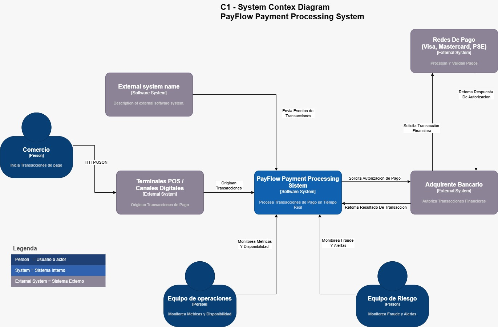
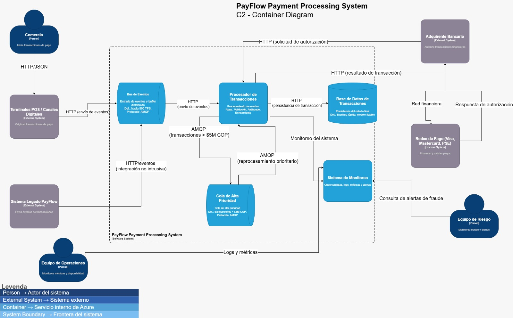
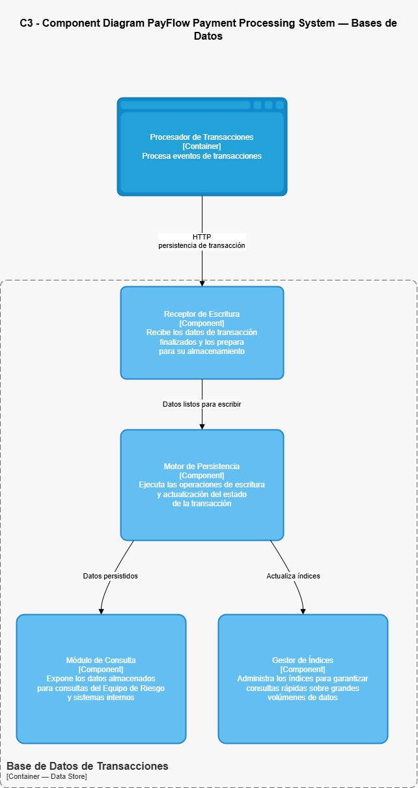
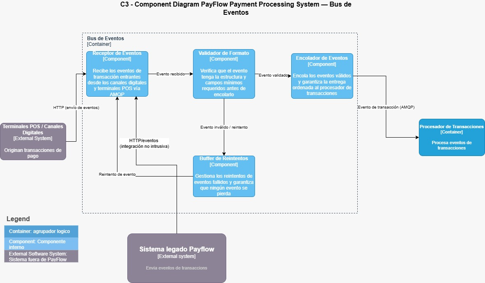
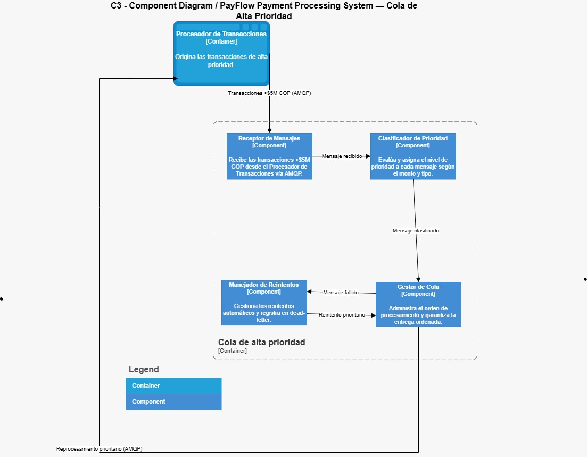
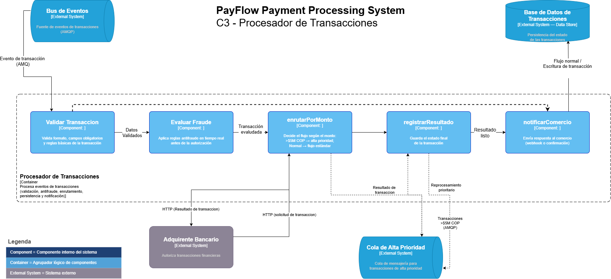
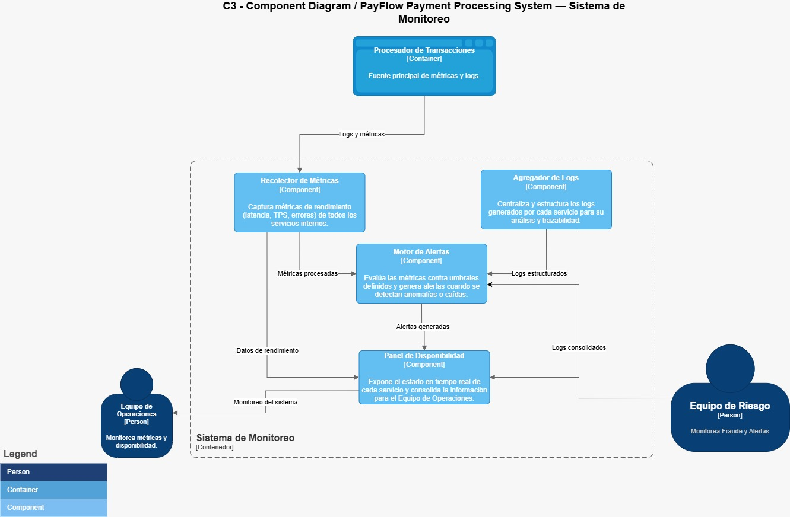

# PayFlow – Arquitectura Event-Driven en Azure

## Portada

**Proyecto:** PayFlow – Sistema de procesamiento de transacciones en tiempo real  
**Arquitectura:** Event-Driven sobre Microsoft Azure  
**Tecnologías:** Azure Event Hubs, Azure Functions, Azure Service Bus, Cosmos DB, Azure Monitor

---

## Descripción del sistema

Este proyecto implementa una arquitectura basada en eventos para el procesamiento de transacciones de la fintech PayFlow. El sistema está diseñado para soportar altos volúmenes de transacciones, garantizar baja latencia, aplicar validación antifraude en tiempo real y proporcionar observabilidad completa del flujo de eventos.

---

## Arquitectura C4

### Contexto

#### Función del sistema

El sistema **PayFlow** procesa pagos en tiempo real. Recibe transacciones desde comercios y canales digitales, las envía al adquirente bancario para autorización y retorna el resultado del pago.




#### Componentes principales

**-Comercio**  
Es quien inicia la transacción de pago.

**-Terminales POS / Canales Digitales**  
Capturan el pago y lo envían a PayFlow.

**-PayFlow Payment Processing System**  
Sistema central que procesa y coordina toda la transacción.

**-Adquirente Bancario**  
Autoriza o rechaza la transacción financiera.

**-Redes de Pago (Visa, Mastercard, PSE)**  
Validan y procesan los pagos bancarios.

**-Equipo de Operaciones**  
Monitorea métricas y disponibilidad del sistema.

**-Equipo de Riesgo**  
Supervisa fraude y alertas.

#### Interacciones clave

Flujo principal del pago:  
Comercio → POS/Canales → PayFlow → Adquirente → Redes de Pago

Luego la respuesta vuelve:  
Redes → Adquirente → PayFlow → Comercio

---

### Contenedores

#### Función del sistema

El sistema **PayFlow Payment Processing System** procesa transacciones de pago mediante una arquitectura basada en eventos. Recibe pagos desde terminales POS y canales digitales, envía los eventos al Bus de Eventos, donde posteriormente son procesados, validados y enrutados por el Procesador de Transacciones. Luego, las transacciones son almacenadas en la Base de Datos y enviadas al adquirente bancario para obtener la autorización financiera. Además, el sistema incorpora monitoreo, alertas y manejo prioritario de transacciones de alto valor.




#### Componentes principales

- **Comercio** — Inicia las transacciones de pago.
- **Terminales POS / Canales Digitales** — Capturan las transacciones y las envían al sistema mediante HTTP/JSON.
- **Bus de Eventos** — Recibe y distribuye eventos de transacciones utilizando AMQP.
- **Procesador de Transacciones** — Valida, procesa, enruta y coordina las transacciones financieras.
- **Cola de Alta Prioridad** — Gestiona transacciones críticas o mayores a $5M COP para reprocesamiento prioritario.
- **Base de Datos de Transacciones** — Almacena el estado y resultado final de las transacciones.
- **Sistema de Monitoreo** — Centraliza logs, métricas, observabilidad y alertas del sistema.
- **Adquirente Bancario** — Autoriza o rechaza las transacciones financieras.
- **Redes de Pago (Visa, Mastercard, PSE)** — Procesan y validan las operaciones financieras.
- **Equipo de Operaciones** — Monitorea disponibilidad, logs y métricas del sistema.
- **Equipo de Riesgo** — Supervisa alertas y eventos relacionados con fraude.

#### Interacciones clave

Flujo principal del pago:  
Comercio → POS/Canales → Bus de Eventos → Procesador de Transacciones → Adquirente Bancario → Redes de Pago

Luego la respuesta vuelve:  
Redes de Pago → Adquirente → Procesador de Transacciones → Base de Datos

Flujo de monitoreo:  
Procesador/Base de Datos → Sistema de Monitoreo → Equipos de Operaciones y Riesgo

Flujo prioritario:  
Procesador de Transacciones → Cola de Alta Prioridad → Reprocesamiento AMQP

#### Comunicación utilizada

- Comunicación HTTP/JSON entre terminales POS, canales digitales y el sistema PayFlow.
- Protocolo AMQP para envío y reprocesamiento de eventos entre componentes internos.
- Comunicación HTTP para solicitudes de autorización y persistencia de transacciones.
- Reprocesamiento prioritario de transacciones mayores a $5M COP mediante la Cola de Alta Prioridad.
- Flujo de logs, métricas y alertas hacia el Sistema de Monitoreo.

---

### Componentes

El propósito de los diagramas C3 es mostrar la estructura interna y el funcionamiento de cada contenedor definido en el modelo C2.

En este nivel se representan los componentes principales que conforman cada servicio, su lógica interna, responsabilidades y la forma en que interactúan entre sí para procesar las transacciones del sistema PayFlow.

Cada uno de los 5 diagramas C3 describe el comportamiento interno de un componente clave de la arquitectura, permitiendo entender cómo fluye la información, cómo se ejecutan los procesos y cómo se realiza la comunicación entre servicios dentro del sistema.

#### C3 — Bases de Datos Transacciones

**Función del componente**

La Base de Datos de Transacciones se encarga de almacenar, actualizar y exponer la información de las transacciones procesadas por PayFlow. Su función principal es garantizar la persistencia del estado final de cada operación financiera y permitir consultas rápidas y seguras para monitoreo, auditoría y análisis.




**Componentes principales**

- **Receptor de Escritura** — Recibe las transacciones finalizadas desde el Procesador de Transacciones y prepara los datos para almacenamiento.
- **Motor de Persistencia** — Ejecuta las operaciones de escritura y actualización del estado de las transacciones en la base de datos.
- **Módulo de Consulta** — Permite acceder a las transacciones almacenadas para consultas internas y monitoreo del Equipo de Riesgo.
- **Gestor de Índices** — Administra índices para optimizar búsquedas y consultas sobre grandes volúmenes de datos.

**Interacciones clave**

Flujo principal de persistencia: Procesador de Transacciones → Receptor de Escritura → Motor de Persistencia

Flujo de almacenamiento y consulta: Motor de Persistencia → Base de Datos → Módulo de Consulta

Flujo de optimización: Motor de Persistencia → Gestor de Índices

**Comunicación utilizada**

- Comunicación HTTP entre el Procesador de Transacciones y el Receptor de Escritura para enviar transacciones finalizadas.
- Flujo interno de datos entre el Receptor de Escritura y el Motor de Persistencia para preparación y almacenamiento de información.
- Operaciones de escritura y actualización ejecutadas por el Motor de Persistencia sobre la Base de Datos de Transacciones.
- Comunicación interna hacia el Gestor de Índices para optimizar búsquedas y consultas.
- Exposición de datos mediante el Módulo de Consulta para sistemas internos y monitoreo del Equipo de Riesgo.

---

#### C3 — Bus de Eventos

**Función del componente**

El Bus de Eventos se encarga de recibir, validar, organizar y distribuir los eventos de transacciones dentro del sistema PayFlow. Su función principal es garantizar una comunicación desacoplada y confiable entre los canales de pago y el Procesador de Transacciones, asegurando que ningún evento se pierda durante el flujo de procesamiento.



**Componentes principales**

- **Receptor de Eventos** — Recibe los eventos de transacciones provenientes de terminales POS, canales digitales y sistemas legados mediante HTTP y AMQP.
- **Validador de Formato** — Verifica que cada evento tenga la estructura y los campos requeridos antes de ser procesado.
- **Encolador de Eventos** — Organiza y envía los eventos válidos al Procesador de Transacciones utilizando AMQP.
- **Buffer de Reintentos** — Gestiona eventos fallidos o inválidos, permitiendo reintentos para evitar pérdida de información.

**Interacciones clave**

Flujo principal del evento: POS/Canales → Receptor de Eventos → Validador de Formato → Encolador de Eventos → Procesador de Transacciones

Flujo de validación: Validador de Formato → Evento válido → Encolador de Eventos

Flujo de reintentos: Evento inválido → Buffer de Reintentos → Receptor de Eventos

Integración con sistemas legados: Sistema Legado PayFlow → Receptor de Eventos

**Comunicación utilizada**

- Comunicación HTTP y AMQP para recepción de eventos desde terminales POS, canales digitales y sistemas legados.
- Flujo interno entre el Receptor de Eventos y el Validador de Formato para verificar la estructura de los mensajes.
- Comunicación AMQP entre el Encolador de Eventos y el Procesador de Transacciones para distribución de eventos.
- Reenvío de eventos fallidos mediante el Buffer de Reintentos para garantizar continuidad operativa.
- Integración con sistemas legados mediante envío de eventos al Bus de Eventos.

---

#### C3 — Cola de Alta Prioridad
**Función del sistema**

El sistema PayFlow gestiona una cola de alta prioridad para procesar transacciones financieras críticas mayores a 5 millones COP. Recibe mensajes vía AMQP, clasifica su prioridad, administra el orden de procesamiento y ejecuta reintentos automáticos en caso de fallos para garantizar la entrega confiable.




**Componentes principales**

- **Procesador de Transacciones** — Origina las transacciones de alta prioridad y las envía al sistema de cola mediante AMQP.
- **Cola de Alta Prioridad** — Contenedor principal que centraliza la recepción, clasificación y gestión de mensajes prioritarios.
- **Receptor de Mensajes** — Recibe las transacciones mayores a 5M COP enviadas desde el Procesador de Transacciones vía AMQP.
- **Clasificador de Prioridad** — Evalúa cada mensaje según su monto y tipo para asignar el nivel de prioridad correspondiente.
- **Gestor de Cola** — Administra el orden de procesamiento de los mensajes y garantiza la entrega ordenada.
- **Manejador de Reintentos** — Gestiona reintentos automáticos de mensajes fallidos y registra eventos en dead-letter.

**Interacciones clave**

Flujo principal de procesamiento prioritario: Procesador de Transacciones → Receptor de Mensajes → Clasificador de Prioridad → Gestor de Cola

Flujo de recuperación y reintentos: Gestor de Cola → Manejador de Reintentos → Gestor de Cola

**Comunicación utilizada**

- Protocolo AMQP para envío y reprocesamiento de mensajes.
- Reprocesamiento prioritario para garantizar continuidad operativa ante fallos.

---

#### C3 — Procesador de Transacciones

**Función del sistema**

El sistema PayFlow procesa eventos de transacciones financieras en tiempo real. Valida la información de la transacción, aplica controles antifraude, enruta operaciones según prioridad, registra el resultado final y notifica al comercio. Además, integra una cola de alta prioridad para transacciones mayores a 5 millones COP y garantiza persistencia y reprocesamiento confiable.



>>>>>>> recuperacion
**Componentes principales**

- **Bus de Eventos** — Fuente externa de eventos de transacciones enviados mediante AMQP.
- **Procesador de Transacciones** — Contenedor principal que orquesta el flujo completo de procesamiento: validación, antifraude, enrutamiento, persistencia y notificación.
- **Validar Transacción** — Valida formato, campos obligatorios y reglas básicas de la transacción.
- **Evaluar Fraude** — Ejecuta reglas antifraude en tiempo real antes de autorizar la operación financiera.
- **enrutarPorMonto** — Decide el flujo de procesamiento según el monto: mayor a 5M COP → flujo prioritario / monto normal → flujo estándar.
- **registrarResultado** — Guarda el estado final y resultado de la transacción procesada.
- **notificarComercio** — Envía la respuesta final al comercio mediante webhook o confirmación.
- **Adquirente Bancario** — Sistema externo encargado de autorizar o rechazar transacciones financieras.
- **Cola de Alta Prioridad** — Sistema externo de mensajería que procesa transacciones críticas mayores a 5M COP mediante AMQP.
- **Base de Datos de Transacciones** — Almacena persistentemente el estado y resultado de las transacciones.

**Interacciones clave**

Flujo principal de procesamiento: Bus de Eventos → Validar Transacción → Evaluar Fraude → enrutarPorMonto → registrarResultado → notificarComercio

Flujo de autorización bancaria: enrutarPorMonto → Adquirente Bancario → registrarResultado

Flujo prioritario: enrutarPorMonto → Cola de Alta Prioridad → registrarResultado

Persistencia de datos: registrarResultado → Base de Datos de Transacciones

Notificación final: notificarComercio → Comercio/cliente externo

**Comunicación utilizada**

- AMQP para recepción y reprocesamiento de transacciones prioritarias.
- HTTP para solicitudes y respuestas con el adquirente bancario.
- Webhooks para notificación al comercio.

---

#### C3 — Sistema de Monitoreo
**Función del sistema**

El sistema de monitoreo de PayFlow supervisa en tiempo real el rendimiento, disponibilidad y comportamiento de los servicios internos. Centraliza métricas y logs, detecta anomalías, genera alertas operativas y proporciona visibilidad continua al Equipo de Operaciones y al Equipo de Riesgo.




**Componentes principales**

- **Procesador de Transacciones** — Fuente principal de métricas y logs generados durante el procesamiento de transacciones.
- **Sistema de Monitoreo** — Contenedor encargado de recopilar, procesar y visualizar métricas, logs y alertas operativas.
- **Recolector de Métricas** — Captura métricas de rendimiento como latencia, TPS y errores provenientes de los servicios internos.
- **Agregador de Logs** — Centraliza, estructura y consolida los logs generados por cada servicio para análisis y trazabilidad.
- **Motor de Alertas** — Evalúa métricas y logs contra umbrales definidos para detectar anomalías, caídas o comportamientos críticos.
- **Panel de Disponibilidad** — Expone en tiempo real el estado de cada servicio y consolida la información operativa para monitoreo continuo.
- **Equipo de Operaciones** — Monitorea métricas, disponibilidad y estado general del sistema.
- **Equipo de Riesgo** — Supervisa alertas relacionadas con fraude, anomalías y eventos críticos.

**Interacciones clave**

Flujo de monitoreo y métricas: Procesador de Transacciones → Recolector de Métricas → Motor de Alertas → Panel de Disponibilidad

Flujo de logs y trazabilidad: Procesador de Transacciones → Agregador de Logs → Motor de Alertas

Flujo de visualización operativa: Panel de Disponibilidad → Equipo de Operaciones

Flujo de supervisión de riesgo: Agregador de Logs → Equipo de Riesgo

**Comunicación utilizada**

- Recolección continua de métricas de rendimiento y disponibilidad.
- Centralización y consolidación de logs para trazabilidad.
- Generación automática de alertas basadas en umbrales y anomalías detectadas.
- Visualización en tiempo real mediante paneles operativos.

---

### Código

**Código fuente del sistema PayFlow (implementación del flujo)**

Este apartado describe el código utilizado para simular la arquitectura event-driven de PayFlow en Azure. Incluye el generador de eventos, la lógica de validación antifraude, el enrutamiento de transacciones de alto valor, el almacenamiento y la observabilidad del sistema.

**Relación con la arquitectura del sistema**

La siguiente implementación en código reproduce de forma simplificada la arquitectura event-driven documentada en el README del proyecto PayFlow. Cada componente lógico del flujo se simula mediante estructuras en memoria o funciones específicas que representan los servicios de Azure.

- **Azure Event Hubs (Ingesta de eventos):** Se simula mediante la estructura `event_hub`, la cual actúa como el buffer de entrada donde se almacenan las transacciones generadas por el sistema.
- **Azure Functions (Procesamiento y validación):** Representadas por la función `Procesados`, donde se ejecuta la lógica de validación de formato y reglas básicas de antifraude.
- **Azure Service Bus (Enrutamiento de alto valor):** Simulado mediante la estructura `service_bus`, que almacena únicamente las transacciones clasificadas como "en revisión" o de alto valor.
- **Cosmos DB (Persistencia de datos):** Representado por `cosmos_db`, donde se almacenan todas las transacciones procesadas con su estado final (aprobada, rechazada o en revisión).
- **Azure Monitor (Observabilidad):** Simulado mediante el uso de pandas para consolidar métricas del sistema a partir de `procesados`, permitiendo analizar el estado general del flujo de transacciones.

Este DataFrame permite observar el comportamiento del sistema en términos de volumen de transacciones, estados finales y distribución del procesamiento, emulando las capacidades de monitoreo de Azure Monitor.

Los comandos utilizados para ejecutar el flujo completo del sistema desde el paso 1 al 5 son los siguientes:

```bash
# Generación de eventos de transacción simulados (Event Hubs)
python event_generator.py

# Validación de transacciones y aplicación de reglas antifraude
python function_validate.py

# Enrutamiento de transacciones de alto valor hacia Service Bus
python service_bus_sim.py

# Registro de transacciones procesadas en Cosmos DB
python cosmos_sim.py

# Análisis y visualización de métricas del sistema (Azure Monitor simulado)
python monitor.py
```

**Conclusión técnica**

La implementación demuestra un flujo completo basado en eventos donde las transacciones son generadas, validadas, clasificadas por riesgo, almacenadas y monitoreadas. Aunque es una simulación local, reproduce el comportamiento de una arquitectura distribuida en Azure, cumpliendo los objetivos de escalabilidad, desacoplamiento y observabilidad definidos en el diseño del sistema PayFlow.

---

## ADRs (Decisiones Arquitectónicas)

- ADR-01: Event Hubs vs Service Bus
- ADR-02: Azure Functions vs Stream Analytics
- ADR-03: Cosmos DB vs Azure SQL Database
- ADR-04: Service Bus vs Storage Queue
- ADR-05: Azure Monitor vs herramientas de terceros

---

### ADR-01 — Selección de Azure Event Hubs como mecanismo de ingesta principal de eventos de transacciones

| Campo | Descripción |
|---|---|
| **Título** | Selección de Azure Event Hubs como mecanismo de ingesta principal de eventos de transacciones |
| **Contexto** | PayFlow enfrenta un cuello de botella crítico en su arquitectura monolítica actual, la cual soporta únicamente 40 transacciones por segundo, generando latencias superiores a 8 segundos en escenarios de alta demanda y ocasionando pérdida de transacciones. La nueva arquitectura debe soportar al menos 500 transacciones por segundo, garantizar latencias menores a 2 segundos y permitir un procesamiento desacoplado y escalable. Adicionalmente, debe integrarse de forma no intrusiva con el sistema legado (sin modificaciones), operar bajo restricciones regulatorias que exigen almacenamiento en regiones certificadas como Brazil South y mantenerse dentro de un presupuesto máximo de $60 USD en fase piloto. En este contexto, es necesario seleccionar un servicio que actúe como punto de entrada capaz de absorber picos de carga, desacoplar productores y consumidores, y habilitar el procesamiento asíncrono mediante Azure Functions en Python o Node.js. |
| **Alternativas evaluadas** | **Azure Event Hubs:** es un servicio de ingestión de eventos diseñado específicamente para escenarios de alto throughput y streaming en tiempo real. Permite manejar millones de eventos por segundo mediante un modelo basado en particiones, lo que habilita escalabilidad horizontal. Funciona como un buffer distribuido que desacopla completamente los productores (sistema legado y nuevos canales) de los consumidores (Azure Functions). Su integración nativa con Azure Functions mediante triggers reduce la complejidad de implementación y permite procesamiento en paralelo. Además, su costo en el tier básico es bajo y predecible, lo que lo hace adecuado para el piloto. Sin embargo, no incluye características avanzadas de mensajería como dead-letter queue o control estricto de orden. **Azure Service Bus:** es un servicio de mensajería empresarial orientado a escenarios que requieren alta confiabilidad y control del flujo de mensajes. Ofrece colas y tópicos con soporte de reintentos automáticos, dead-letter queue, sesiones y orden garantizado. Es ideal para procesos críticos donde la consistencia y la trazabilidad son prioritarias. No obstante, su arquitectura no está optimizada para ingestión masiva de eventos, presenta mayor latencia en escenarios de alto volumen y menor capacidad de throughput en comparación con Event Hubs. Además, su uso como punto de entrada para grandes volúmenes puede generar mayores costos y afectar el cumplimiento del presupuesto del piloto. |
| **Decisión** | Se selecciona Azure Event Hubs como el mecanismo principal de ingesta de eventos de transacciones, ya que es el servicio que mejor se alinea con los requerimientos de alto throughput y procesamiento en tiempo real definidos por PayFlow. Su capacidad de actuar como buffer distribuido permite absorber picos de demanda sin degradar el sistema, eliminando el cuello de botella de la arquitectura actual. La integración nativa con Azure Functions facilita el procesamiento desacoplado y escalable en los lenguajes soportados por el equipo (Python y Node.js), cumpliendo además con la restricción de experiencia técnica. Desde el punto de vista de negocio, permite una integración no intrusiva con el sistema legado, ya que puede recibir eventos sin requerir modificaciones en su lógica interna. Finalmente, su costo en el tier básico garantiza que la solución se mantenga dentro del límite presupuestal del piloto, cumpliendo simultáneamente con las restricciones regulatorias al poder desplegarse en regiones certificadas como Brazil South. |
| **Consecuencias** | **Ventajas:** la adopción de Event Hubs permite eliminar el cuello de botella del sistema monolítico al habilitar un modelo de ingestión altamente escalable y distribuido. Se logra desacoplar completamente la entrada de eventos del procesamiento, mejorando la resiliencia del sistema ante picos de carga. Se facilita la implementación de una arquitectura event-driven moderna, con procesamiento paralelo mediante Azure Functions y capacidad de escalar horizontalmente según la demanda. Además, se garantiza un costo bajo y controlado en la fase piloto, junto con una integración sencilla con el ecosistema Azure. **Trade-offs:** al no seleccionar Azure Service Bus como punto de entrada principal, se sacrifican capacidades avanzadas de mensajería como el manejo automático de reintentos, el uso de dead-letter queues para auditoría de errores y el orden estricto de mensajes mediante sesiones. Estas funcionalidades son críticas en escenarios financieros, por lo que deben ser incorporadas posteriormente en la arquitectura mediante el uso complementario de Service Bus para transacciones de alto valor. Esto introduce una mayor complejidad en el diseño general, ya que obliga a distribuir la responsabilidad de confiabilidad entre múltiples servicios y a implementar lógica adicional en Azure Functions para el manejo de errores y consistencia del procesamiento. |

---

### ADR-02 — Selección de Azure Functions como motor de procesamiento de eventos en tiempo real

| Campo | Descripción |
|---|---|
| **Título** | Selección de Azure Functions como motor de procesamiento de eventos en tiempo real |
| **Contexto** | PayFlow requiere procesar cada transacción en tiempo real aplicando validaciones, reglas antifraude antes de la autorización y enrutamiento dinámico según el monto (especialmente para transacciones mayores a $5.000.000 COP). El sistema debe cumplir con una latencia menor a 2 segundos en el percentil P99, soportar un throughput de hasta 500 transacciones por segundo y garantizar un modelo desacoplado que evite dependencias entre componentes críticos como validación, autorización y notificación. Adicionalmente, la solución debe integrarse de forma nativa con Azure Event Hubs como punto de entrada, Azure Service Bus para flujos críticos y un sistema de persistencia como Cosmos DB o SQL. Existen restricciones claras: el equipo de desarrollo trabaja con Python y Node.js, el sistema debe mantenerse dentro de un presupuesto máximo de $60 USD en fase piloto, y debe operar en regiones certificadas como Brazil South. |
| **Alternativas evaluadas** | **Azure Functions:** es un servicio serverless orientado a la ejecución de código bajo demanda, permitiendo procesar eventos de forma individual mediante triggers (como Event Hubs). Soporta lenguajes como Python y Node.js, lo cual se alinea directamente con las capacidades del equipo. Permite implementar lógica personalizada compleja, incluyendo validaciones, reglas antifraude en tiempo real y enrutamiento dinámico. Ofrece escalabilidad automática basada en la carga, lo que permite manejar picos de hasta cientos de transacciones por segundo sin intervención manual. Su modelo de pago por ejecución lo hace altamente eficiente en costos para escenarios variables, especialmente en fase piloto. **Azure Stream Analytics:** es un motor de procesamiento de streams basado en consultas declarativas similares a SQL. Está diseñado para análisis en tiempo real, agregaciones y transformaciones de datos en flujo continuo. Su principal ventaja es la simplicidad en la definición de consultas y su capacidad para procesar grandes volúmenes de datos sin necesidad de desarrollar código complejo. Sin embargo, presenta limitaciones importantes en escenarios que requieren lógica condicional avanzada, ejecución de reglas de negocio dinámicas o integración compleja con múltiples servicios. No está diseñado para implementar lógica imperativa por evento, lo que lo hace menos adecuado para el contexto de PayFlow. |
| **Decisión** | Se selecciona Azure Functions como el motor de procesamiento de eventos, debido a su capacidad para ejecutar lógica personalizada y compleja por cada transacción en tiempo real. Esta decisión permite implementar de manera directa las funciones críticas del sistema, como validación de datos, evaluación antifraude previa a la autorización y enrutamiento dinámico según el monto de la transacción. Además, su compatibilidad con Python y Node.js garantiza que el equipo pueda desarrollar y mantener la solución sin curva de aprendizaje adicional. Desde el punto de vista económico, el modelo serverless en Consumption Plan permite optimizar costos, ya que solo se paga por ejecución. |
| **Consecuencias** | **Ventajas:** la adopción de Azure Functions permite implementar una lógica de negocio altamente flexible y adaptable, lo que es clave para escenarios financieros donde las reglas pueden cambiar constantemente. Se logra procesamiento en tiempo real por evento, cumpliendo con los requisitos de latencia (<2s) y throughput (500 tx/s). La escalabilidad automática permite responder eficientemente a picos de demanda sin intervención manual, mientras que el modelo de pago por ejecución asegura un uso eficiente del presupuesto en fase piloto. **Trade-offs:** al no seleccionar Azure Stream Analytics, se sacrifica la simplicidad de un modelo declarativo basado en consultas SQL para el procesamiento de streams. Toda la lógica debe ser desarrollada manualmente en Azure Functions, aumentando la complejidad del código, el esfuerzo de mantenimiento y la responsabilidad del equipo en aspectos como manejo de errores, reintentos y control de flujo. |

---

### ADR-03 — Uso de Cosmos DB como solución principal de persistencia de transacciones

| Campo | Descripción |
|---|---|
| **Título** | Uso de Cosmos DB como solución principal de persistencia de transacciones |
| **Contexto** | PayFlow requiere almacenar el estado de cada transacción procesada en tiempo real, incluyendo su resultado (aprobada, rechazada o en revisión), garantizando alta disponibilidad, baja latencia y capacidad de soportar hasta 500 transacciones por segundo. La solución debe integrarse de forma nativa con Azure Functions, permitir un modelo de datos flexible que soporte distintos tipos de transacciones (pagos, reembolsos, transferencias), y mantener un enfoque desacoplado dentro de la arquitectura event-driven. Existe una restricción crítica: el free tier de Cosmos DB podría no estar disponible, lo que implica un riesgo de costos si no se gestiona adecuadamente el consumo de recursos. |
| **Alternativas evaluadas** | **Cosmos DB:** base de datos NoSQL distribuida diseñada para cargas de trabajo de alta velocidad y baja latencia. Permite escrituras rápidas mediante un modelo basado en unidades de solicitud (RU/s), soporta escalabilidad horizontal automática y ofrece un modelo de datos flexible en formato JSON, ideal para sistemas event-driven. Su integración nativa con Azure Functions permite persistir datos directamente desde el procesamiento de eventos. Sin embargo, su modelo de costos basado en RU/s requiere una gestión cuidadosa para evitar sobrecostos, especialmente si el free tier no está disponible. **Azure SQL Database:** base de datos relacional que ofrece consistencia fuerte, soporte para transacciones ACID y capacidad de ejecutar consultas complejas. Puede operar en un tier gratuito limitado, lo que la hace atractiva desde el punto de vista económico. Sin embargo, no está optimizada para cargas de escritura masiva en tiempo real y puede convertirse en un cuello de botella en escenarios de alto throughput como el de PayFlow. |
| **Decisión** | Se selecciona Cosmos DB como solución principal de persistencia, debido a su capacidad para manejar cargas de escritura intensivas con baja latencia. Su modelo flexible basado en documentos JSON permite adaptarse fácilmente a distintos tipos de transacciones sin necesidad de rediseñar esquemas. No obstante, debido a la restricción del free tier, se adopta una estrategia de mitigación de costos, que incluye la configuración de un throughput mínimo (RU/s controladas) y, en caso de no poder mantenerse dentro del presupuesto del piloto, la posibilidad de migrar o complementar con Azure SQL Database como alternativa secundaria. |
| **Consecuencias** | **Ventajas:** el uso de Cosmos DB permite alcanzar altas tasas de escritura con baja latencia, asegurando que el sistema pueda registrar transacciones en tiempo real sin convertirse en un cuello de botella. Su modelo flexible facilita la gestión de diferentes tipos de eventos y su integración con Azure Functions reduce la complejidad de implementación. **Trade-offs:** al no seleccionar Azure SQL Database como solución principal, se sacrifica la consistencia relacional fuerte y la capacidad de ejecutar consultas complejas sobre datos estructurados. Asimismo, el uso de Cosmos DB introduce la necesidad de gestionar cuidadosamente el consumo de RU/s y diseñar correctamente las particiones para evitar sobrecostos. |

---

### ADR-04 — Uso de Azure Service Bus para el enrutamiento de transacciones de alto valor

| Campo | Descripción |
|---|---|
| **Título** | Uso de Azure Service Bus para el enrutamiento de transacciones de alto valor |
| **Contexto** | Dentro de los requerimientos del sistema de PayFlow, se establece que todas las transacciones cuyo monto supere los $5.000.000 COP deben ser procesadas a través de un canal diferenciado que garantice mayor prioridad, confiabilidad en la entrega y registro obligatorio de auditoría. Este flujo es crítico desde el punto de vista del negocio, ya que involucra operaciones de alto impacto financiero que no pueden perderse ni procesarse de manera incorrecta. Además, el sistema debe mantener un enfoque desacoplado, integrarse con Azure Functions y operar dentro de un presupuesto máximo de $60 USD en fase piloto. |
| **Alternativas evaluadas** | **Azure Service Bus:** es un servicio de mensajería empresarial diseñado para escenarios críticos que requieren alta confiabilidad. Ofrece colas avanzadas con características como reintentos automáticos, dead-letter queue (DLQ) para manejo de errores, soporte de sesiones que permiten garantizar el orden de los mensajes y entrega bajo el modelo at-least-once. **Azure Storage Queue:** es un servicio de mensajería simple, altamente escalable y de bajo costo, adecuado para escenarios donde no se requiere alta complejidad en el manejo de mensajes. Sin embargo, carece de características avanzadas como dead-letter queue nativa, control de orden, sesiones o reintentos automáticos sofisticados. Esto limita su capacidad para manejar flujos críticos que requieren auditoría y confiabilidad estricta, como las transacciones de alto valor en PayFlow. |
| **Decisión** | Se selecciona Azure Service Bus como el mecanismo de enrutamiento para transacciones de alto valor, ya que es el servicio que mejor cumple con los requisitos de confiabilidad, trazabilidad y control exigidos por este tipo de operaciones. Para cumplir con la restricción de costos, su uso se limita exclusivamente a transacciones mayores a $5.000.000 COP, evitando un consumo innecesario de recursos y manteniendo el sistema dentro del presupuesto del piloto. |
| **Consecuencias** | **Ventajas:** la adopción de Azure Service Bus permite garantizar un procesamiento confiable de las transacciones de alto valor, asegurando que ningún mensaje se pierda y que los errores puedan ser gestionados mediante mecanismos como dead-letter queue. Se obtiene un alto nivel de trazabilidad, lo cual es fundamental para auditorías y cumplimiento regulatorio. **Trade-offs:** al no seleccionar Azure Storage Queue, se sacrifica una solución más simple y económica. Service Bus introduce mayor complejidad en la configuración y operación del sistema, incluyendo la gestión de colas, sesiones y dead-letter queues. También implica un costo más alto por operación, lo que obliga a limitar su uso únicamente a transacciones críticas para cumplir con el presupuesto. |

---

### ADR-05 — Uso de Azure Monitor y Application Insights para la observabilidad del sistema

| Campo | Descripción |
|---|---|
| **Título** | Uso de Azure Monitor y Application Insights para la observabilidad del sistema |
| **Contexto** | PayFlow presenta actualmente una observabilidad limitada, donde los problemas operativos se detectan de forma reactiva a través de reportes manuales de los comercios, lo que genera retrasos en la identificación de fallas y afecta la experiencia del usuario. La nueva arquitectura requiere un sistema de monitoreo centralizado que permita visualizar en tiempo real el flujo de transacciones, medir métricas clave como throughput, latencia y tasa de errores, y generar alertas automáticas en menos de 30 segundos. |
| **Alternativas evaluadas** | **Azure Monitor + Application Insights:** solución nativa de Azure para monitoreo y observabilidad. Permite recolectar métricas, logs y trazas distribuidas de todos los servicios del ecosistema Azure. Ofrece dashboards en tiempo real, integración directa con los servicios sin necesidad de configuraciones complejas y capacidad de generar alertas automáticas con baja latencia. Cuenta con un nivel gratuito (hasta 5 GB de logs/mes) ideal para fases piloto. **Soluciones de terceros (Datadog, New Relic, entre otras):** herramientas especializadas en observabilidad con capacidades avanzadas de visualización, correlación de eventos y análisis profundo del comportamiento del sistema. Sin embargo, requieren integración adicional con los servicios de Azure y principalmente implican costos significativamente más altos, lo que dificulta cumplir con la restricción presupuestal del proyecto en fase piloto. |
| **Decisión** | Se selecciona Azure Monitor junto con Application Insights como la solución de observabilidad del sistema, debido a su integración nativa con todo el ecosistema Azure y su capacidad de proporcionar monitoreo en tiempo real sin necesidad de herramientas adicionales. Permite configurar alertas automáticas con tiempos de respuesta inferiores a 30 segundos, cumpliendo con los requerimientos del sistema. Su modelo de pago por consumo y el nivel gratuito disponible permiten mantener el costo dentro del presupuesto del piloto. |
| **Consecuencias** | **Ventajas:** permite obtener visibilidad completa del sistema en tiempo real, facilitando la detección temprana de errores, cuellos de botella y anomalías en el flujo de transacciones. La capacidad de generar alertas automáticas mejora la capacidad de respuesta del equipo de operaciones, evitando dependencias de reportes manuales. El modelo de costo controlado permite cumplir con las restricciones del proyecto sin comprometer la calidad del monitoreo. **Trade-offs:** al no seleccionar soluciones de terceros, se sacrifican capacidades avanzadas de análisis y visualización altamente personalizada. Se asume una mayor dependencia del ecosistema Azure (vendor lock-in). Para mantener los costos dentro del presupuesto, es necesario aplicar estrategias como muestreo de telemetría, lo que puede reducir el nivel de detalle en algunos escenarios de monitoreo. |

---

## Flujo de procesamiento de transacciones

La solución propuesta para PayFlow implementa una arquitectura orientada a eventos (Event-Driven Architecture) diseñada para soportar procesamiento de transacciones financieras en tiempo real, garantizando desacoplamiento entre componentes, alta escalabilidad, resiliencia operativa y capacidad de crecimiento progresivo hacia escenarios productivos de alta demanda.

El flujo completo inicia con la generación de eventos de transacción mediante un script desarrollado en Python, el cual simula el comportamiento de terminales POS, canales digitales y sistemas externos que originan operaciones financieras. Cada evento contiene información relevante de la transacción, como identificador, monto, comercio, timestamp y estado inicial de procesamiento.

Posteriormente, los eventos son enviados al Bus de Eventos implementado sobre Azure Event Hubs, el cual actúa como capa de ingesta distribuida y desacoplada. Este componente permite absorber grandes volúmenes de transacciones concurrentes sin impactar directamente los sistemas consumidores, funcionando como un buffer altamente escalable y resiliente. Gracias a su modelo basado en particiones y comunicación asíncrona mediante AMQP, el sistema puede soportar escenarios de alta concurrencia manteniendo estabilidad operativa y baja latencia.

Una vez recibidos los eventos, Azure Functions ejecuta el procesamiento principal de cada transacción en tiempo real. Dentro de este flujo se implementan validaciones funcionales y controles antifraude básicos, verificando la integridad de los datos, campos obligatorios, formatos válidos y reglas de negocio definidas para el procesamiento financiero. Este enfoque serverless permite escalabilidad automática basada en la carga transaccional, optimizando costos y recursos computacionales.

Como parte de la lógica de negocio, las transacciones cuyo monto supera los $5.000.000 COP son identificadas y enrutadas dinámicamente hacia Azure Service Bus, utilizando un flujo prioritario independiente. Este mecanismo garantiza mayor confiabilidad, trazabilidad y resiliencia para operaciones críticas de alto valor financiero. Además, el uso de colas avanzadas permite incorporar capacidades como reintentos automáticos, manejo de errores y procesamiento desacoplado sin afectar el flujo principal de transacciones.

Después del procesamiento y validación, el estado final de cada transacción es persistido en Cosmos DB, utilizando un modelo flexible basado en documentos JSON. Esta estrategia permite almacenar distintos tipos de operaciones financieras sin depender de esquemas rígidos, facilitando la evolución futura del sistema. Cosmos DB proporciona baja latencia de escritura, alta disponibilidad y capacidad de escalabilidad horizontal, características fundamentales para arquitecturas financieras orientadas a eventos.

De manera transversal, toda la solución es monitoreada mediante Azure Monitor y Application Insights, permitiendo centralizar métricas operativas, logs, trazabilidad distribuida y alertas automáticas. Esto proporciona visibilidad completa sobre el comportamiento del sistema, facilitando la detección temprana de errores, cuellos de botella y anomalías en tiempo real.
>>>>>>> recuperacion

---

## Evidencias de implementación

Como parte del desarrollo de la arquitectura propuesta, se generaron evidencias funcionales que validan el comportamiento integral del flujo de procesamiento de transacciones implementado para PayFlow.

Las evidencias permiten demostrar la interacción entre los componentes principales de la arquitectura, validando tanto el flujo estándar como el procesamiento prioritario de transacciones críticas.

Entre las principales evidencias implementadas se incluyen:

Generación de eventos de transacción mediante simulación controlada.
Recepción y procesamiento de eventos en Azure Functions.
Validación funcional y evaluación básica antifraude.
Enrutamiento dinámico de transacciones de alto valor hacia Azure Service Bus.
Persistencia del estado final de las transacciones en Cosmos DB simulado.
Registro de métricas y eventos operativos para observabilidad.
Validación del desacoplamiento entre componentes mediante comunicación asíncrona.

Todas las evidencias del funcionamiento del sistema se encuentran organizadas dentro de la carpeta /assets, permitiendo verificar visualmente la ejecución de cada etapa del flujo arquitectónico.

Las evidencias se encuentran en la carpeta `/assets`.

### Evidencia de ejecución del flujo transaccional


Las capturas y registros generados durante la ejecución del sistema permiten evidenciar el comportamiento operativo de la arquitectura event-driven implementada.

Las evidencias muestran:

Simulación de generación de eventos financieros desde canales externos.
Publicación de eventos hacia el Bus de Eventos.
Procesamiento concurrente de transacciones mediante Azure Functions.
Validación de reglas antifraude y consistencia de datos.
Clasificación de transacciones según el monto procesado.
Enrutamiento prioritario de operaciones críticas hacia Azure Service Bus.
Persistencia del resultado final de las transacciones en Cosmos DB.
Registro de métricas operativas y trazabilidad del sistema.
Simulación de monitoreo y observabilidad centralizada.

Las evidencias presentadas se encuentran directamente relacionadas con los componentes implementados en el directorio /src, donde cada módulo representa una responsabilidad específica dentro de la arquitectura:

event_generator.py
Responsable de la simulación y generación de eventos de transacción.
function_validate.py
Implementa el procesamiento principal, validación de datos y reglas básicas antifraude.
service_bus_sim.py
Gestiona el flujo prioritario y el enrutamiento de transacciones de alto valor.
cosmos_sim.py
Simula la persistencia distribuida y el almacenamiento del estado transaccional.
monitor.py
Centraliza métricas operativas, logs y simulación de observabilidad.

Esta separación de responsabilidades mantiene coherencia con los principios de arquitectura desacoplada definidos en los ADR y representados en los diagramas C4 del sistema.

---

## Observabilidad y monitoreo operativo

La arquitectura incorpora un enfoque de observabilidad orientado a monitoreo continuo y análisis operacional en tiempo real, permitiendo evaluar el comportamiento del sistema durante la ejecución de transacciones financieras.

A través de Azure Monitor y Application Insights se simulan métricas relevantes para la operación del negocio, incluyendo:

Throughput de eventos procesados por segundo.
Latencia promedio de procesamiento transaccional.
Tasa de errores y fallos operativos.
Cantidad de transacciones aprobadas.
Cantidad de transacciones rechazadas.
Transacciones enviadas a revisión.
Eventos reenviados para reprocesamiento.
Métricas de comportamiento del flujo prioritario.
Registro centralizado de logs y trazabilidad.

Este modelo de monitoreo permite detectar anomalías operativas de manera temprana y proporciona visibilidad completa sobre el estado de la plataforma, alineándose con los requerimientos de resiliencia y observabilidad definidos para PayFlow.
>>>>>>> recuperacion

---

## Conclusiones
La arquitectura event-driven diseñada para PayFlow permite transformar un modelo monolítico tradicional en una plataforma desacoplada, escalable y preparada para escenarios de procesamiento financiero en tiempo real.

La adopción de Azure Event Hubs como mecanismo principal de ingesta elimina el cuello de botella presente en la arquitectura original, permitiendo manejar grandes volúmenes de transacciones concurrentes mediante comunicación asíncrona y procesamiento distribuido.

Azure Functions proporciona un modelo serverless flexible y altamente escalable para ejecutar validaciones, reglas antifraude y lógica de negocio en tiempo real, reduciendo tiempos de respuesta y optimizando el consumo de recursos.

El uso de Azure Service Bus para transacciones superiores a $5.000.000 COP introduce un flujo prioritario con mayores garantías de confiabilidad, trazabilidad y resiliencia operativa, aspecto fundamental en escenarios financieros críticos.

Cosmos DB garantiza persistencia distribuida de baja latencia y capacidad de crecimiento horizontal, permitiendo almacenar distintos tipos de transacciones bajo un modelo flexible orientado a eventos.

Finalmente, Azure Monitor y Application Insights proporcionan observabilidad integral del ecosistema, permitiendo monitoreo continuo, generación de alertas y análisis operativo centralizado.

En conjunto, la solución propuesta demuestra cómo una arquitectura cloud-native basada en servicios administrados de Azure puede satisfacer requerimientos de escalabilidad, disponibilidad, desacoplamiento y monitoreo en plataformas financieras modernas.

**Estado del proyecto**

El proyecto cuenta con los siguientes componentes funcionales y arquitectónicos:

Simulación funcional completa del flujo de transacciones financieras.
Implementación de arquitectura basada en eventos (Event-Driven Architecture).
Integración desacoplada entre componentes mediante comunicación AMQP.
Implementación de procesamiento prioritario para transacciones críticas.
Persistencia distribuida simulada mediante Cosmos DB.
Sistema de monitoreo y observabilidad integrado.
Validación funcional del flujo extremo a extremo.
Definición y documentación formal de decisiones arquitectónicas (ADR).
Modelado arquitectónico completo mediante diagramas C4 (C1, C2 y C3).
Coherencia arquitectónica validada entre requerimientos, ADR y componentes implementados.
Preparación de la solución para evolución futura hacia ambientes cloud productivos.
>>>>>>> recuperacion
